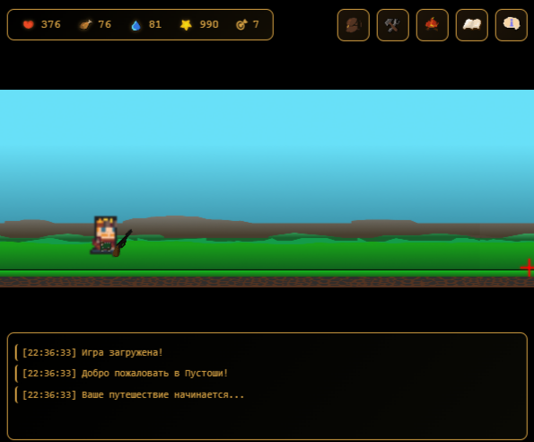
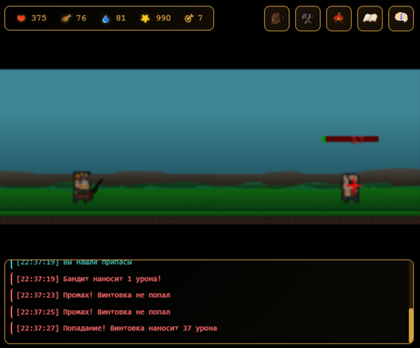
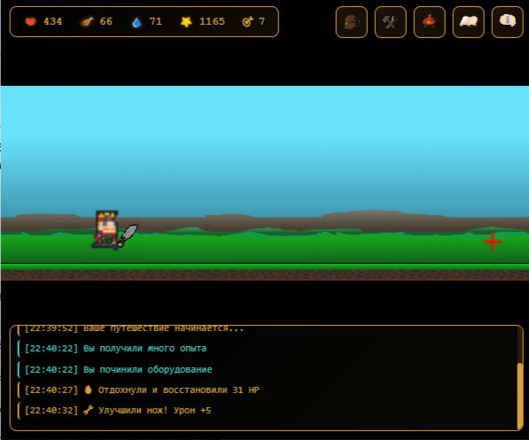
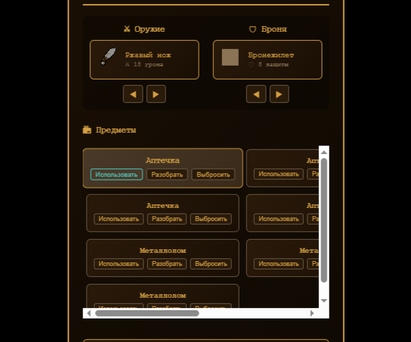
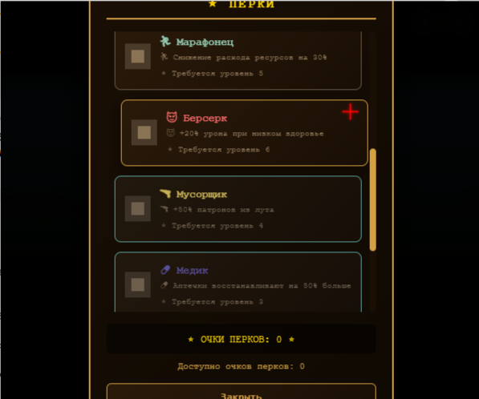
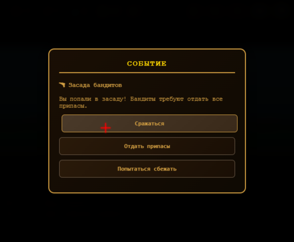
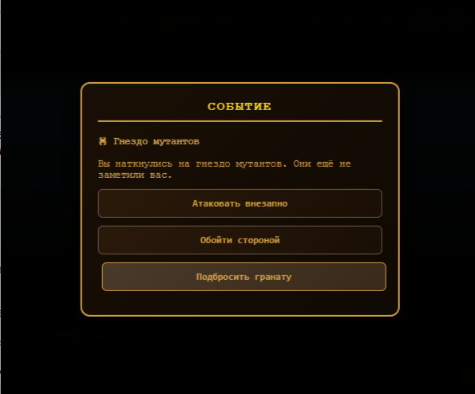

<div align="center">

# 🔫 LOOT BOY: ВЫЖИВАНИЕ В ПУСТОШИ

### *Постапокалиптическая RPG в вашем браузере*

[](https://github.com/yourusername/wasteland-survival)
[](https://chrome.google.com/webstore)
[](LICENSE)
[]()

[](https://developer.mozilla.org/en-US/docs/Web/JavaScript)
[](https://developer.mozilla.org/en-US/docs/Web/HTML)
[](https://developer.mozilla.org/en-US/docs/Web/CSS)
[](https://developer.chrome.com/docs/extensions/)

</div>

---

## 🎮 О ИГРЕ

**"Пустоши: Выживание"** - это постапокалиптическая RPG сделанная по мотивам игры Fallout Setlers, созданная как расширение для браузера Chrome. Выживайте в жестоком мире пустошей, сражайтесь с мутантами, собирайте ресурсы и улучшайте своего персонажа!

### 🌟 Особенности

<div align="center">

| 🎯 **Динамический бой** | 📦 **Система инвентаря** | ⭐ **Перки и прокачка** |
|:---:|:---:|:---:|
| Реалистичная стрельба с прицелом | 10+ видов оружия и брони | 10 уникальных перков |
| Ближний и дальний бой | Крафт и улучшение предметов | 10 уровней прокачки |
| Система критических ударов | Обмен и разбор предметов | Различные билды |

| 🎲 **События** | 💾 **Сохранение** | 🎨 **Визуальный стиль** |
|:---:|:---:|:---:|
| 20+ случайных событий | Автосохранение в Chrome Storage | Спрайтовая графика |
| Моральный выбор | Загрузка прогресса | Анимированные персонажи |
| Влияние на сюжет | Продолжение с места остановки | Динамический фон |

</div>

---

## 🖼️ СКРИНШОТЫ

<div align="center">

### Основной геймплей


*Система ресурсов и статус-бар персонажа*


*Боевая система с прицелом и динамическими эффектами*


*Разбоки на кулаках*

### Интерфейсы


*Система экипировки и инвентаря*


*Древо перков и прокачка персонажа*

### События


*Система случайных событий с выбором*


*Система случайных событий с выбором*

</div>

---

## 🎯 ИГРОВАЯ МЕХАНИКА


### 📊 Характеристики персонажа

| Статистика | Описание | Влияние |
|:---|:---|:---|
| ❤️ Здоровье | Жизненная энергия | Влияет на выживаемость |
| 🍖 Еда | Энергетический ресурс | Уменьшается со временем |
| 💧 Вода | Жидкость для выживания | Уменьшается со временем |
| ⭐ Опыт | Прогресс персонажа | Повышает уровень |
| 🎯 Уровень | Опытность | Открывает перки |

### 🎲 Система событий

Каждые **20 секунд** происходит случайное событие с выбором:

```javascript
const eventTypes = {
    "🏥 Заброшенная больница": "Выбор: обыскать / уйти / рискнуть",
    "📻 Радиосигнал": "Выбор: ответить / игнорировать / вычислить",
    "🕷️ Гнездо мутантов": "Выбор: атаковать / обойти / граната",
    "🚚 Караван": "Выбор: обменять / украсть / помочь"
}
```

---

## 🎮 УПРАВЛЕНИЕ

<div align="center">

| Кнопка | Действие | Описание |
|:---:|:---|:---|
| 📦 | **Инвентарь** | Управление предметами и экипировкой |
| 🔧 | **Крафт** | Улучшение оружия из металлолома |
| 🔥 | **Отдых** | Восстановление здоровья (требует ресурсы) |
| ⭐ | **Перки** | Открытие и изучение способностей |
| 💬 | **Чат** | Система логов и событий |

</div>

### 🖱️ Управление в бою

- **ЛКМ по врагу** - Выстрел/атака
- **Прицел** - Следует за мышью
- **Точность** - Зависит от расстояния

---

## 💪 СИСТЕМА ПЕРКОВ

<div align="center">

| Перк | Эффект | Требование |
|:---:|:---|:---:|
| 💪 Крепкий орешек | +30% к здоровью | Ур. 2 |
| 🔨 Силач | +40% урона в ближнем бою | Ур. 3 |
| 🎯 Снайпер | +50% урона из винтовки | Ур. 3 |
| 🍀 Везунчик | +25% к луту | Ур. 4 |
| 🏃 Марафонец | -30% расхода ресурсов | Ур. 5 |
| 😈 Берсерк | +20% урона при низком HP | Ур. 6 |
| 🔫 Мусорщик | +50% патронов | Ур. 4 |
| 💊 Медик | +50% к лечению | Ур. 3 |
| ⚡ Стрелок | +25% скорости стрельбы | Ур. 5 |
| 🛡️ Выживальщик | +15 к броне | Ур. 4 |

</div>

---

## 🛠️ ТЕХНИЧЕСКИЕ ДЕТАЛИ

### 📁 Структура проекта

```
wasteland-survival/
├── 📄 manifest.json          # Конфигурация расширения
├── 📄 popup.html             # Основной интерфейс
├── 📄 popup.css              # Стили и анимации
├── 📄 game.js                # Основная логика
├── 📄 config.js              # Настройки игры
├── 📄 perks.js               # Система перков
├── 📄 texts.js               # Тексты и события
└── 📁 sprites/               # Графические ресурсы
    ├── 📁 characters/        # Спрайты персонажей
    ├── 📁 weapons/           # Спрайты оружия
    ├── 📁 armor/             # Спрайты брони
    ├── 📁 background/        # Фоны и окружение
    └── 📁 icons/             # Иконки интерфейса
```

## 🚀 УСТАНОВКА

### Для разработки:

1. **Клонируйте репозиторий**
```bash
git clone https://github.com/Gabryelf/Loot-Boy.git
```

2. **Загрузите в Chrome**
   - Откройте `chrome://extensions/`
   - Включите "Режим разработчика"
   - Нажмите "Загрузить распакованное расширение"
   - Выберите папку с проектом


---


</div>


